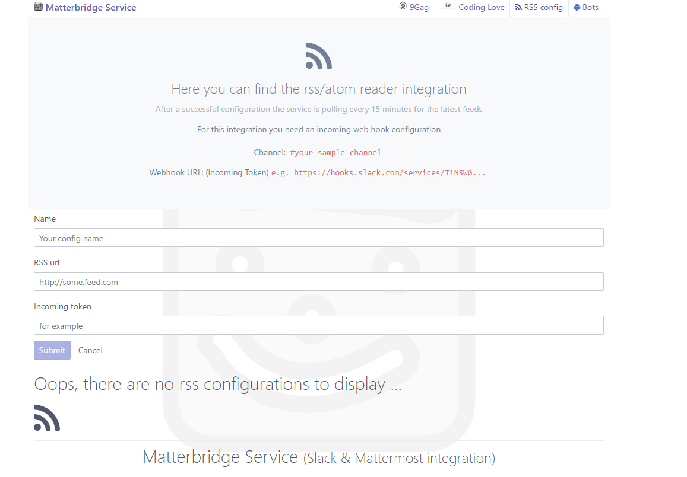

# matterbridge
[](https://travis-ci.org/Freshwood/matterbridge)
## A mattermost and slack bridge with powerful integrations. The goal is to provide integrations which are not present in mattermost and slack

***

## Features
With the [akka.http](http://doc.akka.io/docs/akka-http/current/scala.html) framework you can build modern, fast and powerful web applications.
When you deploy your application you can reach the REST endpoint at **http://your.domain/api/matterbridge**
You can find a sample at **http://matterbridge.softler.net** 
There is always the latest version deployed

The service is supporting Slack and Mattermost web hooks.
[Configuration Sample for Mattermost](https://docs.mattermost.com/guides/integration.html)
[Sample for Slack](https://api.slack.com/custom-integrations)

The service is supporting all types of web hooks:
* Incoming Webhook support (for example the RSS integration)
* Outgoing Webhook support (Bot response feature)
* Slashcommand support (9Gag gifs + coding love gifs)

***

## Workflow
* After start the services is looking every 5 seconds for a single nine gag gif
* We decided to put the interval very slow to reduce the traffic on http://9gag.com
* Every 15 minutes the service is looking for the configured rss feeds
* Support for all kind of webhooks under (api/matterbridge and api/matterbridge/out)

## GUI Overview

#### Landing page

* Gives you a quick overview of all stored entities

#### 9Gag page

* Here you can view the latest 9Gag gifs
* You can also delete a gif, which will never be searched
#### Coding Love integration

* Here you can view the latest coding love gifs
* Keep in mind the services is always looking for a random gif from the coding love
* Only the result will be stored in the database

#### RSS integration

* Here you can configure a new rss integration
* Every 15 minutes the service is looking for the latest feeds
* At this time RSS and ATOM feeds are supported

#### Bots integration

* Here you can configure multiple bots
* The bot name is the trigger keyword from the outgoing response message
* The configured answers will be randmoly send. The same behaviour as the slack bot does.
****

## Deployment
* Grab the latest release from here
* Install the postgres sql database engine on your server (Version 9.6)
* Create a database user which can login to the database
* Create a new database 'matterbridgedb'
* Setup the connection string. Look at the configuration section under this section.
* Start the service. As default the service is listening on Port 9000
* You can reach the front end under (http://localhost:9000) or the configured domain from your server

## Configuration (/conf/application.conf)
`http {`
  `host = "0.0.0.0"`
  `port = 9000`
`}`
* Bind here the host and your port

* Setup the database name and user
  * Here you can override the default slash commands
  * For example /ninegag and /codinglove
  
````scala
database {
  url = "jdbc:postgresql://localhost/matterbridgedb"
  url = ${?PSQL_URL}
  user = "admin"
  user = ${?PSQL_USER}
  password = "Admin12!"
  password = ${?PSQL_PASSWORD}
  driver = org.postgresql.Driver
}
````  

#### Example slack / mattermost configuration

````scala
matterbridge {
  integrations {
    codinglove {
      command = "codinglove"
      response_type = "in_channel"
    }
    ninegag {
      api-url = "https://9gag.com/v1/featured-posts"
      command = "ninegag"
      response_type = "in_channel"
    }
  }
}
````